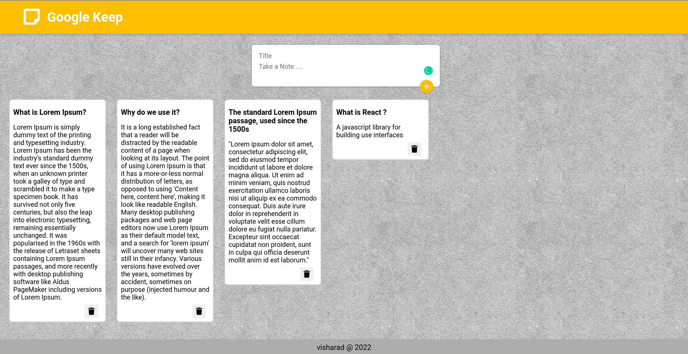

# <p align='center'>Google Keep Clone</p>

### Overview

This project is an attempt to clone basic functionalities of google keep app.

### About
The following functionalities are implemented in this app so far through RESTAPIs
- `Reading` all the data in the database through GET request and display
- `Deleting` selected note
- `Creating` a new note 

Link to front-end and backend part of the projects
- [Frontend repo](https://github.com/VISHARAD17/google-keep-frontend)
- [Backend repo](https://github.com/VISHARAD17/google-keep-backend)

Before running this project make sure you have node or yarn installed.

To run the project locally

1. Clone the frontend and backend repositories
   ```bash
   # frontend
   git clone https://github.com/VISHARAD17/google-keep-frontend.git
   # backend
   git clone https://github.com/VISHARAD17/google-keep-backend.git
   ```
2. To install all the dependencies
   ```bash
   npm install
   ```
3. To run the frontend in the devlopment environment :
   ```bash
   npm start
   ```
4. To run the backend go into the root directory and run :
   ```bash
   node index.js
   ```
This will run frontend and backend on differenct ports.